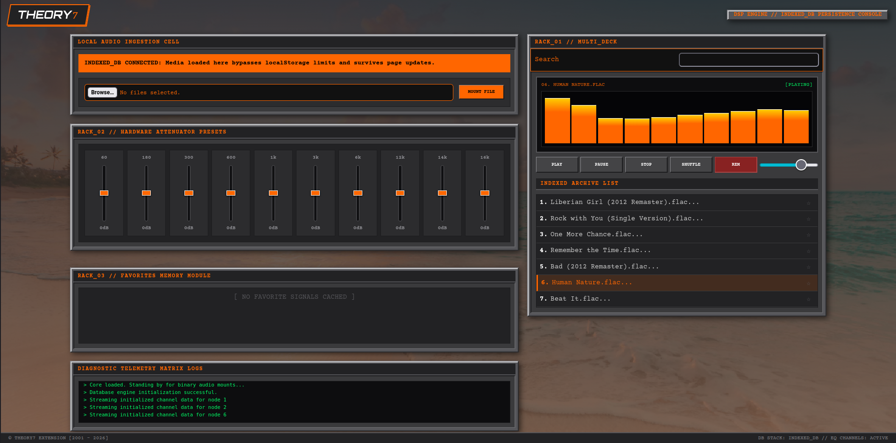

# MusicPlayer
Music player with early internet aesthetics. 

## [Open Here](https://harshvar007.github.io/musicPlayer/)

## Functionalities
- Add multiple media files ( stored in indexed db with unique hash)
- Play , pause , stop , shuffle play.
- Classic 10 band equalizer
- A favourite section - Displays all your favourite songs. Can be toggled on/off from music section. 
- A classic terminal - shows updates like songs loading/addition/deletion from database and more.
- Classic 10 band fft vizualizer.
- Soft search functionality - Using TrieNode+BFS to search.  
